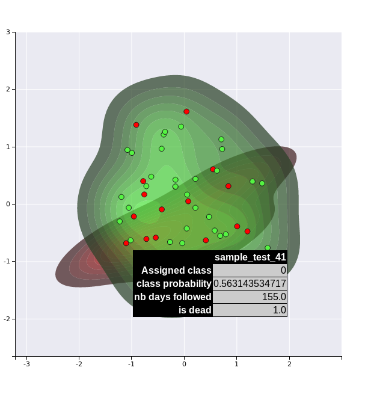
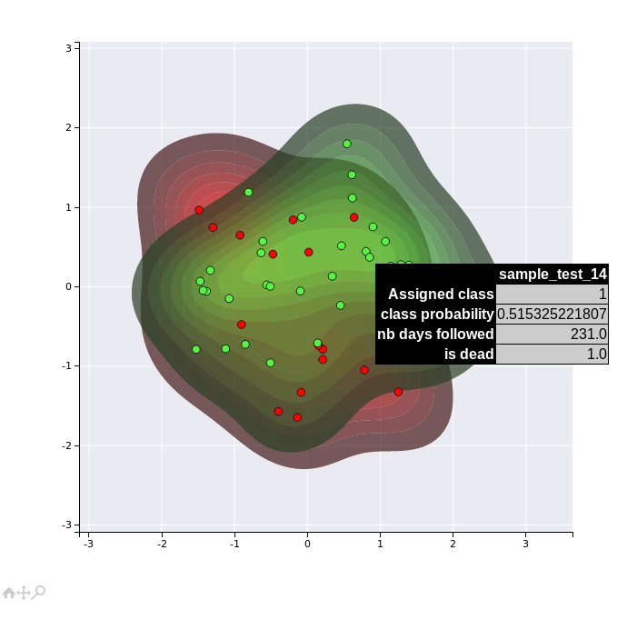

# Tutorial: Advanced usage of DeepProg model

## Visualisation
Once a DeepProg model is fitted, it might be interessant to obtain different visualisations of the samples for the training or the test sets, based on new survival features inferred by the autoencoders.For that purpose, we developped two methods to project the samples into a 2D space that can be called once a `SimDeepBoosting` or a `simDeep` is fitted.

```python
# boosting class instance fitted using the ensemble tutorial
boosting.plot_supervised_predicted_labels_for_test_sets()
```

The first method transforms the OMIC matrix activities into the new survival feature space inferred by the autoencoders and projects the samples into a 2D space using  PCA analysis. The figure creates a kernel density for each cluster and project the labels of the test set.



A second more sophisticated method uses the new features inferred by the autoencoders to compute new features by constructing a supervised network targetting the inferred subtype labels. The new set of features are then projected into a 2D space using PCA analysis. This second method might present more efficient visualisations of the different clusters since it is uses a supervised algorithm.

```python
boosting.plot_supervised_kernel_for_test_sets()
```



Note that these visualisation are not very efficient in that example dataset, since we have only a limited number of samples (40) and features. However, they might become more useful for real datasets.
